[appleboy.tech](https://appleboy.tech/) &nbsp;·&nbsp;
[email](mailto:asser.usamaa@gmail.com) &nbsp;·&nbsp;
[linkedin](https://linkedin.com/in/asserusama) &nbsp;·&nbsp;
[github](https://github.com/asserusama)

> iOS engineer in Cairo, shipping to the Saudi market. 
> Smaller binaries, fewer taps, no dead code.

I write Swift for apps real people pay for, and I keep the tooling around them
honest — automation where the team was clicking, cleanup where the bundle was
carrying weight. Outside work I record Swift in Arabic for
[SwiftCairo](https://www.youtube.com/@SwiftCairo), because the content simply
isn't there yet.

**iOS Software Engineer**, Areeb Technology &nbsp;·&nbsp; <samp>jan 2025 — present</samp> 
Three iOS apps for the Saudi market, $300K in revenue between them. Migrated
them to Liquid Glass, halved the bundle — 120MB to 60MB — with a dead-code and
unused-asset sweep, and built the internal tooling that took 35% off the team's
turnaround.

**iOS Intern**, Decathlon Digital (remote) &nbsp;·&nbsp; <samp>nov 2024 — jan 2025</samp> 
Fixed defects across Decathlon's eight iOS apps alongside ten developers.
Built UI on Vitamin Play, their design-token system, in codebases running
VIPER and MVVM side by side.

**Vertebra** &nbsp;·&nbsp; <samp>swiftui, vision, avfoundation</samp> 
Diagnoses bad posture from the front camera — Vision tracks five joints from 
head to ankle, AVFoundation runs the session. On the App Store.

**Casino of Games** &nbsp;·&nbsp; <samp>swift, multipeer</samp> 
The Egyptian card game, peer-to-peer for up to eight players with synced names 
and selfies. Six trivia round types with live buzz, voting and scoring.

**Gymmaty** &nbsp;·&nbsp; <samp>swiftui, mvvm</samp> 
Browse, search and compare local gyms.

<samp>swift &nbsp; swiftui &nbsp; uikit &nbsp; combine &nbsp; concurrency &nbsp; avfoundation &nbsp; vision &nbsp; swiftdata &nbsp; xcode &nbsp; git</samp>

**[SwiftCairo](https://www.youtube.com/@SwiftCairo)** &nbsp;·&nbsp;
[linkedin](https://www.linkedin.com/company/swiftcairo/) &nbsp;·&nbsp; <samp>jan 2025 — present</samp> 
Recorded a six-hour end-to-end Swift course in Arabic. Helping run a community
of roughly 3,000 developers, and making the video content it runs on.

